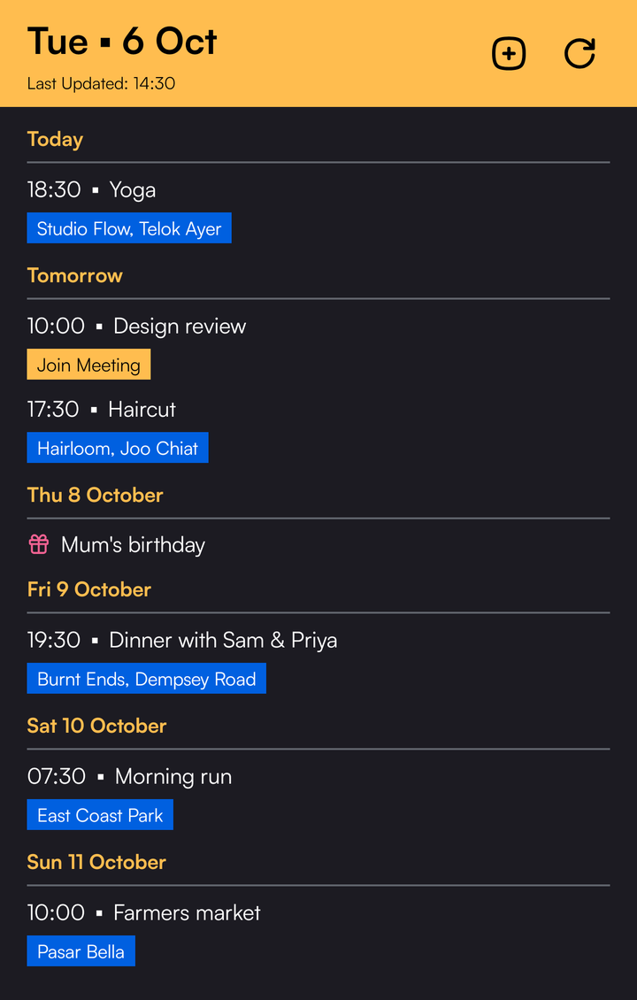
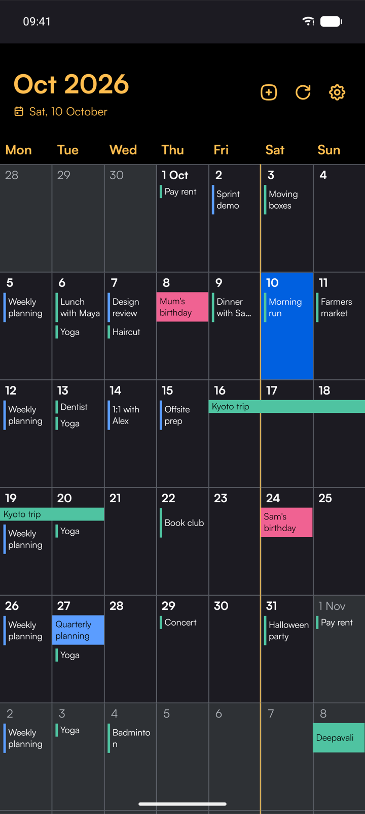
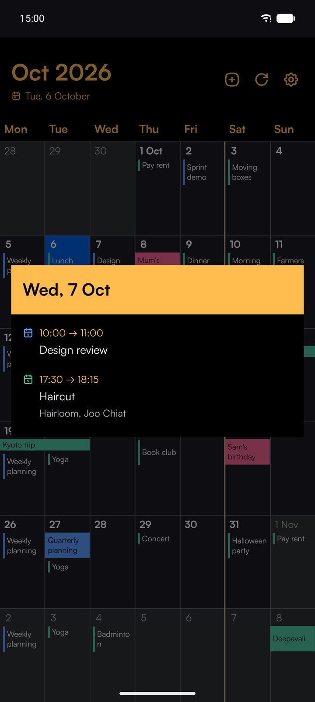
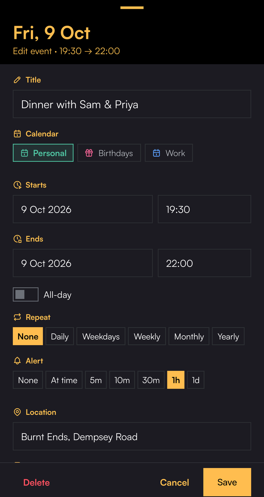
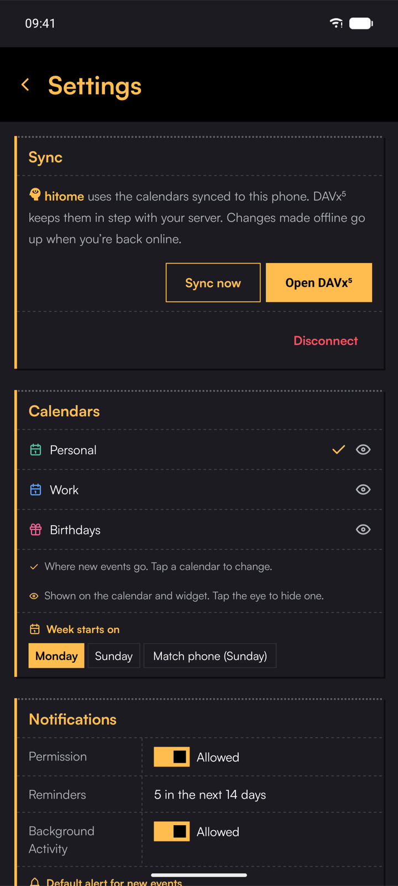

#  hitome

hitome is a calendar for witnessing one's days.

 &nbsp;  &nbsp;  &nbsp;  &nbsp; 

# Capabilities

hitome draws a self-hosted calendar as one continuous grid of weeks on the web
and on Android, edits it without disturbing what other clients wrote, and rings
its reminders on the device itself.

- Every calendar on the account is read at once, and each event carries its own
  calendar's colour and marker glyph, so the month reads as one calendar without
  the calendars being merged.
- The grid is a single ribbon of weeks spanning five years either side of today,
  snapped to month starts. A month boundary is a landing point rather than a
  separate screen, so a week is never drawn twice and scrolling never restarts.
- Fetched months accumulate and are only ever replaced by a fresher fetch,
  never dropped on navigation, which is what used to make events vanish
  mid-scroll. Neighbouring months are prefetched outward in waves.
- Each month keeps its last good result on disk. An unreachable server costs
  freshness, not a blank grid, and the same snapshots feed the alarm pass on a
  cold start.
- An edit rewrites only the fields the editor owns. Unknown properties, foreign
  alarms and recurrence rules richer than the presets survive byte-identical,
  because this calendar is written to by other clients as well.
- Writes carry the object's etag, so an event that changed underneath is
  refused rather than overwritten.
- A repeating event is edited or deleted for this occurrence, this and the
  following ones, or all of them; the series' exceptions move with it. Undo
  puts back exactly what was there, into the calendar it came from.
- Reminders are scheduled as one alarm per concrete occurrence inside a rolling
  two-week horizon, because the platform has no recurring trigger. Every open
  re-derives the whole set and reschedules it, since a force-stop can wipe the
  registrations while still reporting them as scheduled.
- The home-screen widget renders headlessly from its own snapshot, refetching on
  its update cycle and on a tap. It shows the agenda whether or not the server
  is reachable, and an event carrying a recognised meeting link becomes a
  tappable way into that meeting.
- Location autocomplete is the only third-party call, and it fails silently:
  debounced, cached, and abandoned for the session after three consecutive
  failures, leaving an ordinary text field behind. Anything else leaves only
  on a tap: a location opens in Google Maps, a link on its own site.
- On Android it works on the phone's own calendars, which DAVx⁵ (or Google, or
  any sync app) keeps in step with the server. Edits made offline are kept and
  sent when the phone is back online, and Refresh asks the sync app to sync now.
- No credentials are ever built in. On the web you log in on the page: hitome's
  own small server checks the login with the calendar server, keeps it on the
  server side, and gives the browser a cookie its pages cannot read, so no
  browser holds a password at all. On Android hitome holds no address or login
  of its own: the sync app does, so no bundle, image or CI secret holds either,
  and pointing it at a new server is done in DAVx⁵.
- Web and Android ship from one tag. The same commit produces the container
  image and the signed APK, so a full release leaves both on the same version
  (a web-only fix ships alone, with a `-web` suffix). Android is delivered as a release artifact tracked by an updater rather than
  through an app store.

# Running it

The web app is one container. Point it at your CalDAV server (Radicale), put it
behind whatever already serves HTTPS for you, open it and log in with your
calendar account:

```yaml
services:
  hitome:
    image: ghcr.io/miraiconcepts/hitome:latest
    environment:
      CALDAV_URL: http://radicale:5232/
    volumes:
      - hitome-data:/data
volumes:
  hitome-data:
```

The front door, HTTPS and the move from earlier versions are in
[docs/Deploy.md](docs/Deploy.md).

## Android

hitome on Android works on the phone's own calendars, so it needs something to
keep them in step with your server. [DAVx⁵](https://www.davx5.com) does that.

1. **Install DAVx⁵** (F-Droid or Play), add an account with your Radicale
   address and login, and tick the calendars to sync. DAVx⁵'s sync interval is
   how soon an event added elsewhere shows up here.
2. **Install hitome** from the [releases](https://github.com/miraiconcepts/hitome/releases)
   (`hitome-vX.Y.Z.apk`), or add `https://github.com/MiraiConcepts/hitome` to
   [Obtainium](https://github.com/ImranR98/Obtainium) to get updates as they
   come. The APK is for 64-bit ARM phones (arm64-v8a), Android 7 or newer, and is
   signed with a certificate whose SHA-256 fingerprint is
   `37:BA:82:EF:A8:B2:A4:9C:A5:41:D3:9E:C3:43:98:7B:E0:C4:BE:65:7F:1D:E8:81:1C:26:25:71:B7:36:76:D3`.
3. **Open hitome and allow calendar access.** It asks for notifications at the
   same time, for reminders (Settings shows their state). Reminders are exact
   alarms; if your phone restricts background apps, exempt hitome from battery
   optimisation or they can arrive late.
4. **Add the widget** by long-pressing the home screen, choosing Widgets, then
   hitome. Tapping an event opens it; the plus adds one.

Problems and ideas: the link under Settings, About.
